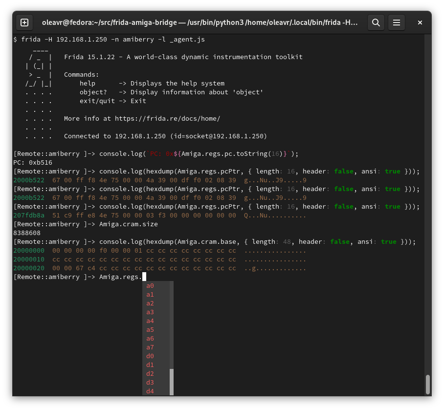

# frida-amiga-bridge

Amiga emulator instrumentation using Frida.



## Supported emulators

Currently only [Amiberry](https://github.com/midwan/amiberry), for now only
tested on [The A500 Mini](https://retrogames.biz/products/thea500-mini/).

## Getting started

Either consume from your own [agent](https://github.com/oleavr/frida-agent-example),
or clone this repo and play with it using Frida's REPL:

```sh
$ npm install
$ npm run watch
# Then, in another terminal:
$ frida -H 192.168.1.250 -n amiberry -l _agent.js
```

The generated `_agent.js` makes the Amiga bridge accessible through a global
variable named `Amiga`. The above setup will auto-reload on save. Use an editor
like Visual Studio Code for code completion and instant type-checking feedback.

## Example

```js
import Amiga from "frida-amiga-bridge";

console.log(`PC: 0x${Amiga.regs.pc.toString(16)}`);
console.log(hexdump(Amiga.cram.base, { ansi: true }));
```
